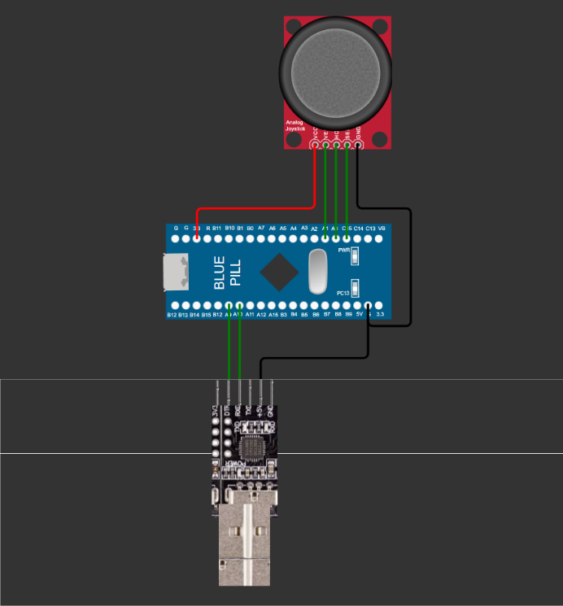
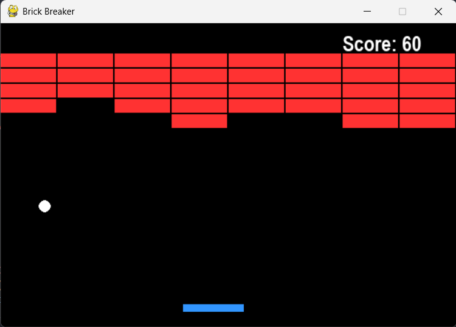
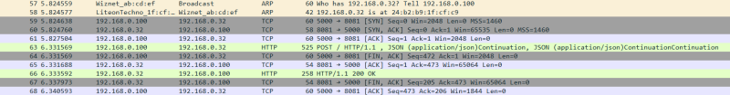

# STM32-Baremetal-C
Baremetal C programming is the process of manually configuring each register of the host MCU right from defining the system clock, PLL and GPIO pin configuration all the way upto peripherals for communication. The board used in these projects is `STM32F103C8T6` a.k.a. `Bluepill`. 

The projects made using Baremetal C are classified as follows:
1. GPIO
2. UART
3. I2C
4. SPI

# GPIO Projects

## 1. Electronic Dice 🎲
Utilizing STM32F103C8T6 a simple 7 segment counter is created. It makes use of 74HC595, 8-bit serial-in, serial or parallel-out shift register with output latches that also has an internal storage register. The storage register buffers the output data which can be clocked independently of the shift register. Thus preventing the data from changing while it is being loaded. It is a SIPO (Serial In Parellel Output) type of a shift register  By making use of the 3 pins namely:
1. ```SH-CP```: Clock pin used to deliver clock signals to the chip when a new data is to be shifted in.
2. ```ST_CP```: Latch pin that is used to display new data/prevent the data from changing when data is being loaded in.
3. ```DS```: Data pin used to send the data bits into the shift register.

An electronic dice refers to a device that can generate a random number between 1-6 and can be used for board games,etc. It used the timer 2 counter value as a seed to generate a random number each time.

### Snaps of the Project
<p align=center>
  
  <p align=center>Connection Diagram</p>
</p>

## 2. 2 Digit 7 Segment Counter 🔢
This is the 2nd project that leverages the barmetal programming capabilities of STM32. The microcontroller particularly used is the ```STM32F103C8T6``` (aka. bluepill). Utilizing STM32F103C8T6 a simple 7 segment counter is created. It also makes use of the 74HC595 which is the 8-bit serial-in, serial or parallel-out shift register as explained above. Here 2 of such shift registers are used in order to display a 2-digit number. The 74HC595 ICs are connected in a daisy chain and it counts from 00 to 99.

### Snaps of the Project
<p align=center>
  
  <p align=center>Connection Diagram</p>
</p>

# UART Projects

## 1. TETRIS 🎮
In this project a game is made using python using the `Pygame` module. The game runs and drops blocks as it listens on a COM port at a baud rate of 9600. the STM32 acts as a Game controller and a PS2 Joystick is connected to the ADC pins of the STM32. As the joystick is moved it changes the resistance of the underlying potentiometers and the direction can be found out using the resistance on the X and Y axes. STM32 has an inbuilt ADC of 12-bits resolution(4096 steps of voltage). At rest the joystick reads 50% on both axes ie (2047, 2047), when joystick is moved left it reads (2047, 4095) and when moved right it reads (2047, 0) and (0, 2047) for forward and (4095, 2047) for backwards. The commands are sent over a USB to TTL module by connecting it to the laptop and the game can thus be cotrolled.

### Snaps of the Project
<p align=center>
  
  <p align=center>Connection Diagram</p>
</p>

<p align=center>
  
  <p align=center>Tetris in Action</p>
</p>

## 2. Brick Breaker 🧱
In this project a game is made using python using the `Pygame` module. The game runs and launches a ball to break bricks as it listens on a COM port at a baud rate of 9600. the STM32 acts as a Game controller and a PS2 Joystick is connected to the ADC pins of the STM32. As the joystick is moved it changes the resistance of the underlying potentiometers and the direction can be found out using the resistance on the X and Y axes. STM32 has an inbuilt ADC of 12-bits resolution(4096 steps of voltage). At rest the joystick reads 50% on both axes ie (2047, 2047), when joystick is moved left it reads (2047, 4095) and when moved right it reads (2047, 0) and (0, 2047) for forward and (4095, 2047) for backwards. The commands are sent over a USB to TTL module by connecting it to the laptop and the game can thus be cotrolled.

### Snaps of the Project
<p align=center>
  
  <p align=center>Brick Breaker in Action</p>
</p>

## 3. GPS Tracker 🌏🛰️
In this project a tracker is made using the L86 GPS module that spits out GPS data using UART in (National Marine Electronics Association)NMEA sentences. These sentences were analysed by STM32 and then sent via bluetooth module HC-05 to the Smartphone app which i made myself to show the location using `Leaflet.js`. The App was developed using the MIT App Inventor and it shows the map with the GPS coordinates.

### Snaps of the Project
<p align=center>
  
  <p align=center>Connection Diagram</p>
</p>

# I2C Projects

## 1. I2C Scanner 🔍
This project was made as a scanner device for finding out the I2C address of a sensor or device for communication and verifying whether the sensor is alive. Since I2C is an address-based communication protocol where a master device uses unique addresses to select and communicate with specific slave devices on a bus it is essential to know the address of the target device. Each slave device on the bus has a unique software-defined address, which allows the master to initiate communication by sending a start condition followed by the address of the target slave.  

### Snaps of the Project
<p align=center>
  
  <p align=center>Connection Diagram</p>
</p>

## 2. I2C Clock 🕒
This project leverages the I2C capabilities of STM32. Paired with the DS3231 I2C Datetime module and the 16x2 I2C LCD Display a clock is developed to show the current Date and Time. 

## Snaps of the Project
<p align=center>
  
  <p align=center>Connection Diagram</p>
</p>

<p align=center>
  
  <p align=center>Circuit in action</p>
</p>


## 3. 4 Channel Multimeter ⚡
This project is developed by using ADS1115 4 channel ADC. It is a 16Bit ADC Converter Module. This module is based on ADS1115 Chip from TI which offers 4 individual channels that can be combined together as well for differential measurement. It is a precision, low-power, 16-bit, I2C compatible, analog-to-digital converter (ADCs). This device incorporates a low-drift voltage reference and an oscillator. The ADS1115 chip also incorporates a programmable gain amplifier (PGA) and a digital comparator. 

## Snaps of the Project
<p align=center>
  
  <p align=center>Connection Diagram</p>
</p>

# SPI Projects

## 1. GET Request using W5500
This project makes use of the W5500 Ethernet module using Serial Peripheral Interface (SPI). It is bulit upon the Wiznet's W5500 chip which is a Hardwired TCP/IP embedded Ethernet Controler that provides internet connectivity to embedded systems. It has a 10/100 Ethernet MAC and PHY embedded. It also supports 8 different sockets with each having independent ports that can run simultaneously. This project shows the GET Request demonstration and how it appears as a request on Wireshark which is a popular packet capture tool for analyzing traffic on a network.

### Snaps of the Project
<p align=center>
  
  <p align=center>Connection Diagram</p>
</p>

<p align=center>
  
  <p align=center>Wireshark Capture</p>
</p>

## 2. POST Request using W5500
This project makes use of the W5500 Ethernet module using Serial Peripheral Interface (SPI). It is bulit upon the Wiznet's W5500 chip which is a Hardwired TCP/IP embedded Ethernet Controler that provides internet connectivity to embedded systems. It has a 10/100 Ethernet MAC and PHY embedded. It also supports 8 different sockets with each having independent ports that can run simultaneously. 

### Snaps of the Project
<p align=center>
  
  <p align=center>Connection Diagram</p>
</p>

<p align=center>
  
  <p align=center>Wireshark Capture</p>
</p>


# License

**Copyright (c) 2025 Sudesh Manjrekar**  
**All rights reserved.**

This repository is provided for **demonstration and portfolio purposes only**.

Unauthorized **copying, modification, distribution, or use** of this code,  
in whole or in part, is **strictly prohibited** without prior written permission  
from the author.
